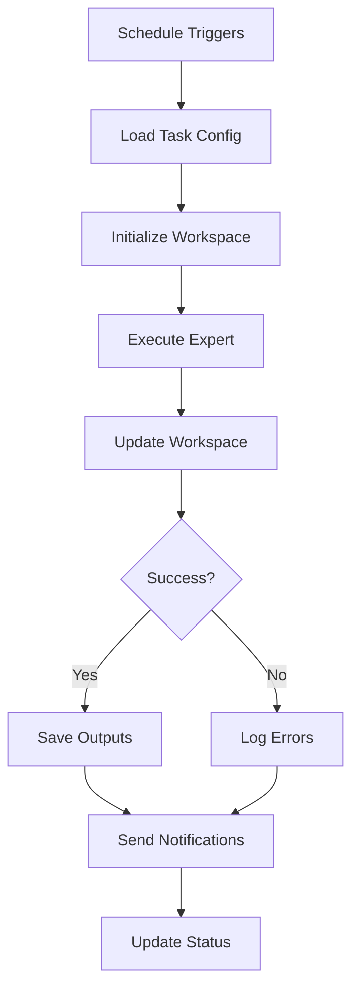

# Tasks & Scheduling

The Tasks system allows you to schedule your experts to run automatically at specific times or intervals. Each task can have its own workspace with todos and files, making it perfect for recurring reports, data processing, monitoring, and automated workflows.

## Overview

<CardGroup cols={3}>
  <Card title="Scheduled Execution" icon="clock">
    Run tasks on a schedule or on-demand
  </Card>
  <Card title="Task Workspace" icon="folder-tree">
    Each task has its own todos and files
  </Card>
  <Card title="Automation" icon="robot">
    Set it and forget it automation
  </Card>
</CardGroup>

## Accessing Tasks

Navigate to **Tasks** in the main sidebar to access the scheduler interface.


## Task Views

The scheduler offers three different views:

<Tabs>
  <Tab title="List View">
    **Best for:** Managing individual tasks
    
    See all tasks in a list with:
    - Task name and description
    - Schedule information
    - Status (active/paused)
    - Last run time
    - Next run time
    - Quick actions
    
    **Actions available:**
    - ▶️ Run Now
    - ⏸️ Pause/Resume
    - 📂 Open Workspace
    - ✏️ Edit Task
    - 🗑️ Delete Task
  </Tab>
  
  <Tab title="Calendar View">
    **Best for:** Visualizing schedules
    
    Calendar display showing:
    - When tasks will run
    - Past executions
    - Upcoming scheduled runs
    - Color-coded by status
    - Day/Week/Month views
    
    **Interact with:**
    - Click dates to see all tasks
    - Drag to reschedule (coming soon)
    - View execution history
  </Tab>
  
  <Tab title="Form View">
    **Best for:** Creating and editing tasks
    
    Detailed form for:
    - Task configuration
    - Schedule settings
    - Input parameters
    - Output handling
    - Workspace options
  </Tab>
</Tabs>

## Creating a Task

<Steps>
  <Step title="Open Task Form">
    Click **Create New Task** or switch to Form View
  </Step>
  
  <Step title="Basic Information">
    - **Task Name**: Descriptive name for the task
    - **Description**: What this task does
    - **Expert/Assistant**: Select which AI to use
    - **Priority**: High, Medium, or Low
  </Step>
  
  <Step title="Configure Schedule">
    Choose scheduling method:
    - **Cron Expression**: For complex schedules
    - **Simple Interval**: Every X hours/days
    - **One-time**: Run once at specific time
    - **Manual Only**: No automatic schedule
  </Step>
  
  <Step title="Set Input">
    Define what the expert should do:
    - **Prompt/Instructions**: Task instructions
    - **Input Data**: Pre-defined data or variables
    - **Context**: Additional information
  </Step>
  
  <Step title="Configure Output">
    How to handle results:
    - **Save to Workspace**: Store files automatically
    - **Send Notification**: Email or webhook
    - **Trigger Webhook**: POST results to URL
    - **Update Database**: Store in system
  </Step>
  
  <Step title="Save & Schedule">
    Review and save the task. It will run according to schedule.
  </Step>
</Steps>

## Schedule Configuration

### Cron Expressions

Use cron syntax for precise scheduling:

```bash
# Format: minute hour day month weekday
# *     *    *   *     *

# Examples:
0 9 * * *           # Every day at 9 AM
0 */6 * * *         # Every 6 hours
0 0 * * 1           # Every Monday at midnight
0 12 * * 1-5        # Weekdays at noon
0 0 1 * *           # First day of each month
*/30 * * * *        # Every 30 minutes
0 8,12,18 * * *     # At 8 AM, noon, and 6 PM
```

**Cron Expression Builder:**
The form includes a visual cron builder to help create expressions without memorizing syntax.

### Simple Intervals

For basic repeating tasks:

<Tabs>
  <Tab title="Hourly">
    ```
    Every 1 hour
    Every 2 hours
    Every 6 hours
    Every 12 hours
    ```
  </Tab>
  
  <Tab title="Daily">
    ```
    Every day at 9:00 AM
    Every day at 6:00 PM
    Twice daily (9 AM and 6 PM)
    ```
  </Tab>
  
  <Tab title="Weekly">
    ```
    Every Monday at 9 AM
    Every Friday at 5 PM
    Weekdays at noon
    ```
  </Tab>
  
  <Tab title="Monthly">
    ```
    1st of every month
    15th and 30th
    Last day of month
    ```
  </Tab>
</Tabs>

## Task Workspace

<Info>
  **New Feature!** Each task has its own workspace separate from chat conversations.
</Info>

### Opening Workspace

Click **Open Workspace** on any task to access its dedicated workspace with:

**Tasks Tab:**
- Todo list specific to this scheduled task
- Track multi-step processes
- Monitor task progress
- Add manual todos for planning

**Files Tab:**
- Files generated by the task
- Input data files
- Output reports
- Logs and results

### Workspace Features

<CardGroup cols={2}>
  <Card title="Persistent State" icon="database">
    Workspace persists between task runs
  </Card>
  <Card title="Version Control" icon="code-branch">
    Track changes across executions
  </Card>
  <Card title="File Management" icon="folder">
    Organize outputs by run date
  </Card>
  <Card title="Todo Tracking" icon="list-check">
    Multi-step task management
  </Card>
</CardGroup>

### Workspace Example

```
Task: "Daily Sales Report"

📋 Todos:
├── ✅ Fetch sales data from database
├── ✅ Calculate daily metrics
├── ✅ Generate charts and graphs
├── ⏳ Write executive summary
└── ⏳ Email report to stakeholders

📁 Files:
├── sales_data_2025-11-25.csv
├── daily_metrics.json
├── sales_chart.png
├── growth_trend.png
└── report_2025-11-25.md
```

## Use Cases

### 1. Daily Reports

<AccordionGroup>
  <Accordion title="Sales Analytics" icon="chart-line">
    **Schedule:** Every day at 8 AM
    
    **Task:**
    - Fetch sales data from previous day
    - Calculate key metrics (revenue, orders, conversion)
    - Generate comparison charts
    - Write summary report
    - Email to management team
    
    **Output:**
    - Daily report PDF
    - CSV data file
    - Chart images
    - Email notification
  </Accordion>
  
  <Accordion title="System Health Report" icon="heart-pulse">
    **Schedule:** Every 6 hours
    
    **Task:**
    - Check server status
    - Monitor error rates
    - Review performance metrics
    - Alert on anomalies
    
    **Output:**
    - Health dashboard JSON
    - Alert notifications (if issues)
    - Historical logs
  </Accordion>
</AccordionGroup>

### 2. Data Processing

<AccordionGroup>
  <Accordion title="ETL Pipeline" icon="database">
    **Schedule:** Every hour
    
    **Task:**
    - Extract data from source systems
    - Transform and clean data
    - Load into data warehouse
    - Validate data quality
    
    **Output:**
    - Processed data files
    - Quality reports
    - Error logs
    - Success/failure notifications
  </Accordion>
  
  <Accordion title="Batch Analysis" icon="magnifying-glass-chart">
    **Schedule:** Daily at midnight
    
    **Task:**
    - Process accumulated data
    - Run machine learning models
    - Generate predictions
    - Update dashboards
    
    **Output:**
    - Analysis results
    - Prediction files
    - Model performance metrics
  </Accordion>
</AccordionGroup>

### 3. Content Generation

<AccordionGroup>
  <Accordion title="Social Media Posts" icon="share-nodes">
    **Schedule:** Weekdays at 9 AM
    
    **Task:**
    - Research trending topics
    - Generate post ideas
    - Create engaging content
    - Schedule for publishing
    
    **Output:**
    - Social media posts
    - Image suggestions
    - Hashtag recommendations
    - Publishing schedule
  </Accordion>
  
  <Accordion title="Blog Article Drafts" icon="pen-to-square">
    **Schedule:** Weekly on Mondays
    
    **Task:**
    - Research topic trends
    - Outline article structure
    - Write draft content
    - Suggest images and SEO
    
    **Output:**
    - Article drafts
    - SEO recommendations
    - Image suggestions
    - Publishing checklist
  </Accordion>
</AccordionGroup>

### 4. Monitoring & Alerts

<AccordionGroup>
  <Accordion title="Website Monitoring" icon="globe">
    **Schedule:** Every 15 minutes
    
    **Task:**
    - Check website availability
    - Test key user flows
    - Monitor response times
    - Alert on failures
    
    **Output:**
    - Uptime status
    - Performance metrics
    - Incident alerts
    - Historical logs
  </Accordion>
  
  <Accordion title="Security Scans" icon="shield-halved">
    **Schedule:** Daily at 2 AM
    
    **Task:**
    - Scan for vulnerabilities
    - Check security updates
    - Review access logs
    - Generate security report
    
    **Output:**
    - Vulnerability report
    - Update recommendations
    - Security alerts
    - Compliance status
  </Accordion>
</AccordionGroup>

## Task Execution

### Execution Flow



### Execution Logs

Each task execution creates a log entry:

- **Start Time**: When execution began
- **End Time**: When it completed
- **Duration**: How long it took
- **Status**: Success, Failed, or Cancelled
- **Output Summary**: What was produced
- **Error Details**: If any errors occurred
- **Resource Usage**: Tokens, API calls, etc.

### Manual Execution

Run any task manually:

<Steps>
  <Step title="Find Task">
    Locate the task in List View
  </Step>
  
  <Step title="Click Run Now">
    Click the ▶️ **Run Now** button
  </Step>
  
  <Step title="Confirm">
    Confirm manual execution
  </Step>
  
  <Step title="Monitor">
    Watch real-time execution in the log
  </Step>
</Steps>

## Output Handling

### Save to Workspace

Automatically save outputs to the task's workspace:

```javascript
{
  save_to_workspace: true,
  file_prefix: "report_",
  include_timestamp: true
  // Saves as: report_2025-11-25_09-00-00.md
}
```

### Email Notifications

Send results via email:

```javascript
{
  notify_email: true,
  recipients: ["team@company.com"],
  subject: "Daily Report - {{date}}",
  attach_outputs: true,
  summary_only: false
}
```

### Webhook Integration

POST results to external systems:

```javascript
{
  webhook_url: "https://api.yourapp.com/tasks/results",
  method: "POST",
  headers: {
    "Authorization": "Bearer token123"
  },
  include_workspace: true
}
```

### Database Storage

Store results in database:

```javascript
{
  save_to_database: true,
  table: "task_results",
  include_metadata: true
}
```

## Task Management

### Pausing Tasks

Temporarily stop a task without deleting:

- Click **Pause** in task actions
- Task won't run on schedule
- Can resume anytime
- Workspace preserved

**When to pause:**
- Maintenance windows
- Testing other configurations
- Temporary suspension
- Seasonal adjustments

### Editing Tasks

Modify existing tasks:

<Warning>
  Changes take effect immediately. Next run will use new configuration.
</Warning>

**Editable fields:**
- Schedule
- Input instructions
- Output handling
- Notification settings

**Cannot change:**
- Task ID
- Historical execution logs
- Existing workspace files

### Deleting Tasks

Permanently remove a task:

<Steps>
  <Step title="Select Task">
    Find the task to delete
  </Step>
  
  <Step title="Click Delete">
    Click the 🗑️ delete icon
  </Step>
  
  <Step title="Confirm">
    Confirm deletion (this is permanent!)
  </Step>
</Steps>

<Warning>
  **Warning:** Deleting a task removes:
  - Task configuration
  - Execution history
  - Workspace todos
  - Workspace files
  
  This action cannot be undone!
</Warning>

## Best Practices

<CardGroup cols={2}>
  <Card title="Naming Convention" icon="tag">
    **Use descriptive names:**
    
    ✅ Good:
    - "Daily Sales Report - 9 AM"
    - "Hourly Server Health Check"
    - "Weekly Content Generation"
    
    ❌ Bad:
    - "Task 1"
    - "Report"
    - "Check"
  </Card>
  
  <Card title="Schedule Wisely" icon="clock">
    **Consider:**
    - Off-peak hours for heavy tasks
    - Business hours for reports
    - Data availability timing
    - API rate limits
    
    **Example:**
    - Heavy processing: 2-4 AM
    - Reports: 8-9 AM before work
    - Monitoring: Every 15 min
  </Card>
  
  <Card title="Error Handling" icon="triangle-exclamation">
    **Always configure:**
    - Error notifications
    - Fallback behavior
    - Retry logic
    - Escalation procedures
    
    **Test failure scenarios:**
    - Missing data
    - API failures
    - Network issues
    - Invalid inputs
  </Card>
  
  <Card title="Resource Management" icon="server">
    **Monitor:**
    - Execution duration
    - Token usage
    - API costs
    - Storage growth
    
    **Optimize:**
    - Adjust frequency if needed
    - Clean old workspace files
    - Use efficient prompts
    - Archive old results
  </Card>
</CardGroup>

## Troubleshooting

<AccordionGroup>
  <Accordion title="Task Not Running" icon="circle-pause">
    **Check:**
    1. Is task active (not paused)?
    2. Is schedule configured correctly?
    3. Are credentials valid?
    4. Is expert/assistant available?
    
    **Debug:**
    - View execution logs
    - Try manual run
    - Check cron expression
    - Verify permissions
  </Accordion>
  
  <Accordion title="Execution Failures" icon="circle-xmark">
    **Common causes:**
    - Invalid input data
    - API key expired
    - Rate limits exceeded
    - Network timeouts
    - Expert configuration issues
    
    **Solutions:**
    - Review error logs
    - Test inputs manually
    - Check API keys
    - Adjust rate limits
    - Update expert configuration
  </Accordion>
  
  <Accordion title="Missing Outputs" icon="file-slash">
    **Verify:**
    - Output handling configured?
    - Workspace save enabled?
    - Correct file paths?
    - Permissions set?
    
    **Check:**
    - Execution logs for errors
    - Workspace files tab
    - Email delivery logs
    - Webhook response codes
  </Accordion>
  
  <Accordion title="Workspace Issues" icon="folder-open">
    **If workspace not updating:**
    1. Refresh the workspace view
    2. Check task execution completed
    3. Verify save_to_workspace enabled
    4. Review execution logs
    
    **If files missing:**
    - Check execution success
    - Verify file generation in logs
    - Look for error messages
    - Contact support if persists
  </Accordion>
</AccordionGroup>

## Next Steps

<CardGroup cols={2}>
  <Card
    title="Distribution Channels"
    icon="share-nodes"
    href="/essentials/distribution-channels"
  >
    Learn about the Tasks distribution channel
  </Card>
  <Card
    title="DeepAgents Workspace"
    icon="folder-tree"
    href="/essentials/deepagents-workspace"
  >
    Understand workspace todos and files
  </Card>
  <Card
    title="Create Expert"
    icon="user-plus"
    href="/essentials/create-expert"
  >
    Create an expert to use in tasks
  </Card>
  <Card
    title="API Reference"
    icon="code"
    href="/api-reference/introduction"
  >
    Programmatic task management via API
  </Card>
</CardGroup>

